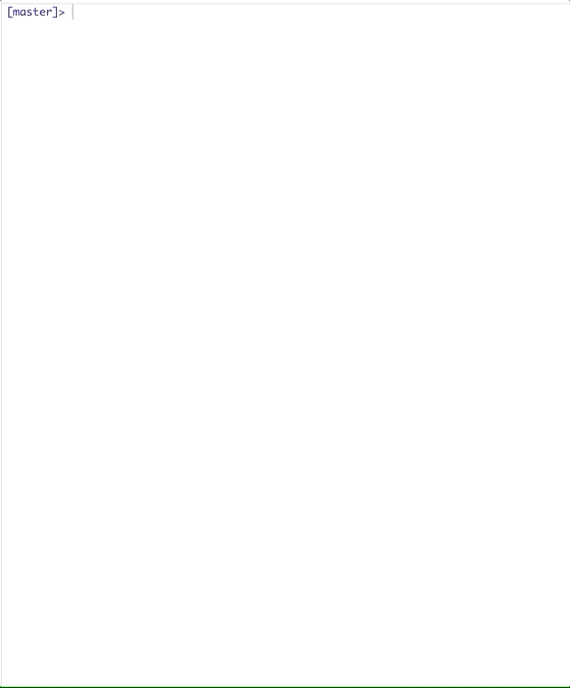
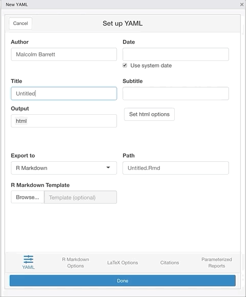

```{r setup, include=FALSE}
library(flexdashboard)
library(tidyverse)

# Setup knitr
knitr::opts_chunk$set(
  echo = FALSE, message = FALSE, warning = FALSE
)
```


```{css}
a, a > code {
  color: #EC99C6;
  text-decoration: none;
}


navbar-inverse {
    background-color: #E69F00;
    border-color: #E69F00;
}

.navbar{
  min-height: 100px;
}

.navbar-brand {
  text-align: center;
  line-height: 50px;
  font-size:64px;
  height: 100px;
}

.chart-title{
  font-size:48px;
  text-align: center;
}

.author{font-size:36px;}

```

<br><br><br>


## Row 1 {data-height=5}

###

<span class = "author">[Malcolm Barrett](http://malco.io/)</span>  &nbsp;&nbsp;&nbsp;&nbsp;
<i class="fab fa-twitter"></i> &nbsp; <a href='https://twitter.com/malco_barrett'> @malco_barrett </a>&nbsp;&nbsp;
<i class="fab fa-github"></i> &nbsp; <a href='https://github.com/malcolmbarrett/'> @malcolmbarrett </a>&nbsp;&nbsp;
<i class="fas fa-envelope"></i> &nbsp; <a href='mailto:malcolmbarrett@gmail.com'> malcolmbarrett@gmail.com </a>


## Row 2 {data-height=85}

### **Write YAML**

```{r, out.height="75%", out.width="75%", echo = FALSE}

```


### **Create R Markdown Documents**

```{r, out.height="75%", out.width="75%", echo = FALSE}

```


### **Learn YAML**


```{r, out.height="75%", out.width="75%", echo = FALSE}
knitr::include_graphics("img/fieldguide.gif")
```


## Row 3 {data-height=5} 

### **Learn more** {data-width=85}

<span class = "author">ymlthis also makes it easier to program with R Markdown files, set up blogdown and bookdown files, and more. Check out the pkgdown site for vignettes to learn more about YAML and ymlthis: [https://ymlthis.r-lib.org/](https://ymlthis.r-lib.org/)</span>


### **Scan me!** {data-width=15}
```{r, out.height="75%", out.width="75%", echo = FALSE}

```


